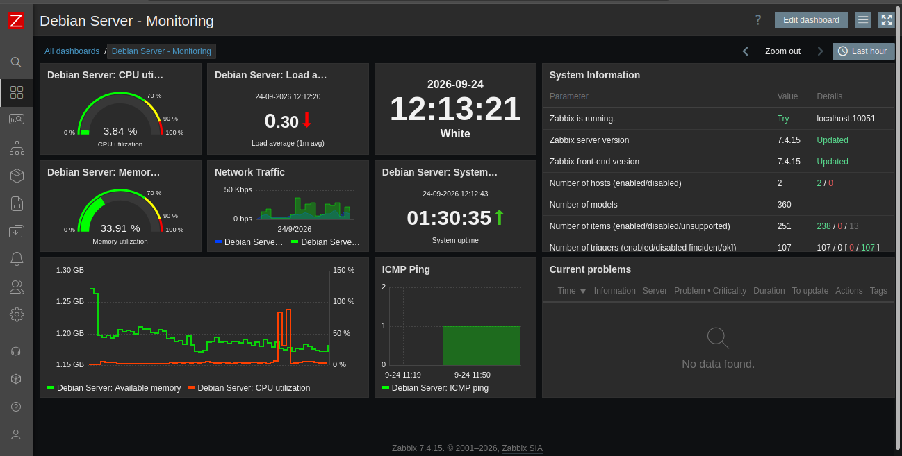
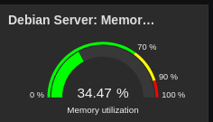
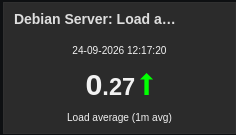
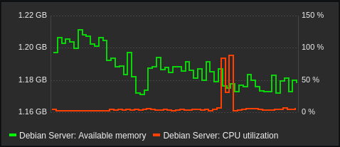
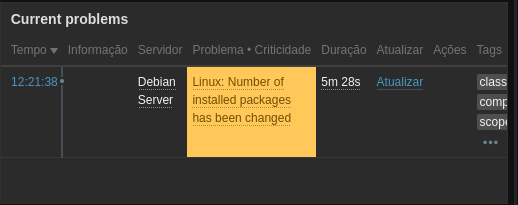

# Lab 05 - Zabbix Custom Dashboard for Debian Server

## Description

This lab documents the creation of a custom monitoring dashboard in Zabbix for a physical Debian 13 server.

The server runs on a low-resource physical machine and is monitored through the Zabbix Agent. The dashboard was designed to provide a quick overview of CPU usage, memory usage, system load, uptime, historical performance, and active problems.

The lab also demonstrates how Zabbix transforms collected metrics into visual information through gauges, graphs, item values, triggers, and problems.

---

## Environment

| Component         | Information                |
| ----------------- | -------------------------- |
| Operating System  | Debian 13                  |
| Architecture      | x86_64                     |
| Kernel            | Linux 6.12.107+deb13-amd64 |
| Server IP         | `192.168.1.117`            |
| Network Interface | `wlan0`                    |
| CPU               | 4 cores                    |
| Total Memory      | 1.79 GB                    |
| Total Swap        | 1.51 GB                    |
| Root Filesystem   | 26.07 GB                   |
| Zabbix Agent      | 7.4.15                     |
| Zabbix Host       | `Debian Server`            |
| Monitoring        | Zabbix Agent               |
| Filesystem        | ext4                       |

---

## 1. Dashboard Overview

The dashboard was created specifically for the `Debian Server` host.

The goal is to keep the most relevant monitoring information visible in a single interface instead of navigating through individual Zabbix sections.

The dashboard contains:

* CPU utilization
* Memory utilization
* System uptime
* Load average
* CPU historical graph
* Memory historical graph
* Active problems



The dashboard provides both real-time values and historical information, making it possible to observe the current state of the server and identify changes in its behavior.

---

## 2. CPU Monitoring

CPU utilization is monitored through a gauge widget.

The gauge provides a quick indication of how much processing capacity is currently being used by the server.

The configured thresholds are:

* 70%: warning level
* 90%: high utilization


During normal operation, the server showed low CPU utilization.

The monitored system has 4 CPU cores and normally operates with a large amount of idle CPU capacity.

---

## 3. Memory Monitoring

Memory utilization is monitored through a dedicated gauge.

This allows the current percentage of used memory to be observed without navigating through the host's individual items.



At the time of the monitoring snapshot, the server had:

* Total memory: 1.79 GB
* Available memory: 1.19 GB
* Memory utilization: 33.7464%
* Available memory: 66.2536%

The server also has 1.51 GB of configured swap.

---

## 4. Load Average

The dashboard also displays the Linux load average as an Item value widget.



The monitored values at the time of the snapshot were:

| Period     | Load Average |
| ---------- | -----------: |
| 1 minute   |       0.1797 |
| 5 minutes  |       0.2549 |
| 15 minutes |       0.3608 |

Load average provides another way of observing the workload experienced by the system.

Unlike CPU utilization, load average represents the amount of work waiting for or using system resources over time.

---

## 5. CPU Historical Graph

A historical graph was added to observe CPU behavior over time.



The graph allows different CPU states to be observed, including:

* User CPU time
* System CPU time
* Idle CPU time
* I/O wait
* Soft IRQ
* Overall CPU utilization

At the time of the monitoring snapshot, the server showed:

* CPU utilization: 6.6633%
* CPU idle: 93.3367%
* CPU user: 4.6056%
* CPU system: 1.6895%
* CPU iowait: 0.2059%
* CPU softirq: 0.05043%

A CPU stress test was also performed using the `stress` utility with all 4 CPU cores to generate a measurable workload and observe the monitoring response.

---

## 6. Memory Historical Graph

A historical graph was also created for memory usage.


The graph makes it possible to observe changes in memory utilization instead of looking only at the current value.

This is useful for identifying gradual memory consumption and changes caused by applications or system processes.

---

## 7. Problem Detection

The dashboard includes a Problems widget filtered specifically for the `Debian Server` host.



During the lab, Zabbix detected a real problem:

**Linux: Number of installed packages has been changed**

The event was generated after the monitored number of installed packages changed.

The problem demonstrated the relationship between Zabbix monitoring components:

```text
Item
  ↓
Trigger
  ↓
Event
  ↓
Problem
  ↓
Dashboard
```

The host currently reports 513 installed packages.

This demonstrates that the dashboard is not only displaying performance metrics. It can also expose events generated by Zabbix triggers.

---

## 8. Network Monitoring

The Debian server uses the `wlan0` interface.

Zabbix automatically discovered and monitors several network-related metrics.

At the time of the snapshot:

| Metric                     |      Value |
| -------------------------- | ---------: |
| Incoming traffic           | 14.52 Kbps |
| Outgoing traffic           |  22.5 Kbps |
| Incoming errors            |          0 |
| Outgoing errors            |          0 |
| Incoming discarded packets |          5 |
| Outgoing discarded packets |          0 |
| Interface status           |         Up |

The network interface is displayed as operational and available to the Zabbix Agent.

---

## 9. Storage and Filesystem Monitoring

The root filesystem is formatted as `ext4`.

The monitored storage values were:

| Metric          |    Value |
| --------------- | -------: |
| Total space     | 26.07 GB |
| Used space      |  1.93 GB |
| Available space | 22.79 GB |
| Used percentage |  7.7952% |
| Free inodes     |   97.43% |

The main storage device is `mmcblk2`.

Zabbix also detected the associated boot partitions:

* `mmcblk2boot0`
* `mmcblk2boot1`

These boot partitions reported no significant activity during the monitoring snapshot.

---

## 10. System Information

The Zabbix host provides several system-level metrics.

Current information includes:

* Operating system: Debian 13
* Kernel: Linux 6.12.107+deb13-amd64
* Architecture: x86_64
* CPU cores: 4
* Installed packages: 513
* Processes: 227
* Running processes: 1
* Logged-in users: 3

The system boot time recorded by Zabbix was:

`24-09-2026 10:42:09`

---

## 11. Server Uptime

The dashboard displays the server uptime directly through an Item value widget.

At the time of the monitoring snapshot, the server had been running for approximately:

`01:41:05`

This provides a quick way to verify whether the server has recently restarted.

---

## 12. Zabbix Agent

The Debian server is monitored using Zabbix Agent 7.4.15.

The agent is configured to accept connections from the Zabbix server and uses the hostname:

`Debian Server`

The agent was successfully detected by Zabbix and reported as available.

The monitoring configuration uses:

```text
Server=127.0.0.1,192.168.1.117
ServerActive=127.0.0.1
Hostname=Debian Server
```

This configuration allows the Zabbix server to communicate with the agent through the server's network address.

---

## 13. Dashboard Color Convention

The dashboard uses visual conventions to make different types of information easier to identify.

| Element          | Representation |
| ---------------- | -------------- |
| Download         | Blue           |
| Upload           | Green          |
| Available memory | Green          |
| CPU utilization  | Orange         |
| Problems         | Red            |

The colors are used as visual indicators and do not replace the actual metric values.

---

## 14. Monitoring Workflow

The monitoring process implemented in this lab can be summarized as:

```text
Debian Server
      │
      │ Zabbix Agent
      ▼
Zabbix Server
      │
      ├── CPU metrics
      ├── Memory metrics
      ├── Network metrics
      ├── Storage metrics
      ├── System metrics
      └── Trigger events
              │
              ▼
       Custom Dashboard
```

The dashboard acts as the visualization layer for the information collected from the physical Debian server.

---

## 15. What I Learned

This lab provided practical experience with:

* Creating custom Zabbix dashboards
* Configuring dashboard widgets
* Monitoring CPU utilization
* Monitoring memory utilization
* Monitoring Linux load average
* Creating historical performance graphs
* Monitoring network interfaces
* Monitoring storage and filesystems
* Understanding Zabbix Items
* Understanding Zabbix Triggers
* Understanding Zabbix Problems
* Working with the Zabbix Agent
* Interpreting Linux server metrics
* Using monitoring data to observe system behavior

---

## 16. Important Observations

The server is a low-resource physical machine with approximately 1.79 GB of RAM and 4 CPU cores.

Despite its limited hardware, the system provides enough resources to run Debian 13 together with the Zabbix monitoring stack used in this laboratory.

The monitoring data also demonstrates that Zabbix can collect a large amount of information from a Linux server without requiring a graphical interface on the monitored machine.

---

## 17. Current Monitoring Snapshot

At the time this laboratory was documented:

| Category              |     Value |
| --------------------- | --------: |
| CPU utilization       |   6.6633% |
| CPU idle              |  93.3367% |
| Memory utilization    |  33.7464% |
| Available memory      |   1.19 GB |
| Root filesystem usage |   7.7952% |
| Load average 1m       |    0.1797 |
| Load average 5m       |    0.2549 |
| Load average 15m      |    0.3608 |
| Installed packages    |       513 |
| Processes             |       227 |
| CPU cores             |         4 |
| Zabbix Agent          |    7.4.15 |
| Agent status          | Available |

---

## 18. Future Improvements

Possible extensions for this laboratory include:

* Add network traffic graphs
* Add disk I/O graphs
* Create additional custom triggers
* Monitor specific services
* Monitor Apache
* Monitor MariaDB
* Add disk space alerts
* Add memory threshold alerts
* Add network availability alerts
* Create a more detailed infrastructure dashboard
* Add additional Linux security monitoring

---

## Project Status

**Completed**

The Debian server is successfully monitored by Zabbix and the custom dashboard provides a centralized view of system performance, resources, network activity, storage, uptime, and detected problems.

## Lab Result

This laboratory resulted in a functional custom Zabbix dashboard for a physical Debian 13 server.

The project demonstrates the complete monitoring flow from the Linux host and Zabbix Agent to the Zabbix Server, triggers, problems, and final dashboard visualization.
