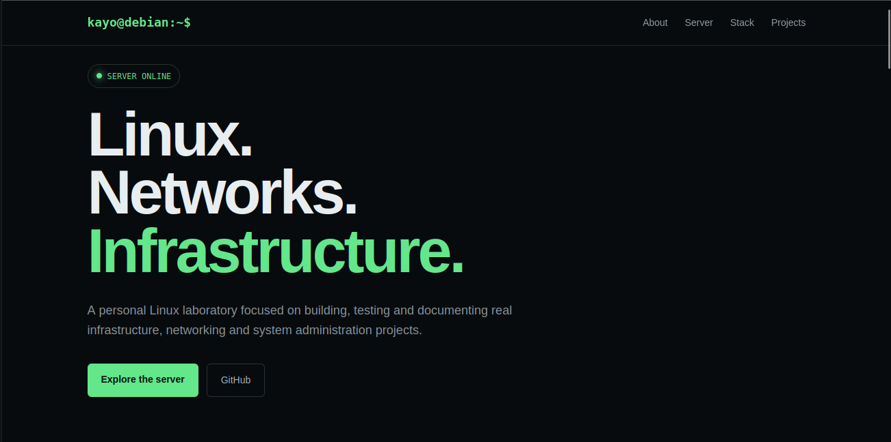
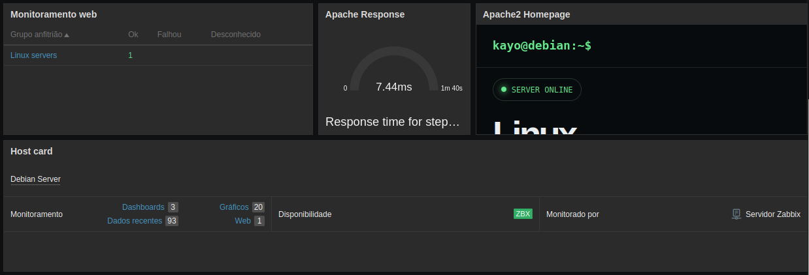

# Lab 06 - Apache Static Web Page

## Overview

This laboratory focuses on deploying and customizing a static web page using Apache HTTP Server on the Debian server.

Unlike the previous laboratories, this server is connected to the main local network:

```text
Network: 192.168.1.0/24
Server: 192.168.1.117
Gateway: 192.168.1.1
Interface: wlan0
```

The Apache server provides the web page through HTTP on port `80`.

The objective of this lab was not only to serve a default Apache page, but to create a custom static website and integrate its availability and response time into the existing Zabbix monitoring environment.

---

## Objectives

* Serve a static website using Apache HTTP Server
* Replace the default Apache page
* Create a custom HTML page with embedded CSS
* Verify HTTP availability
* Test the web server using `curl`
* Monitor the Apache page through Zabbix Web Monitoring
* Monitor Apache response time
* Add the monitored web page to the Zabbix dashboard
* Create a visual representation of the server's web service

---

## Environment

| Component         | Configuration              |
| ----------------- | -------------------------- |
| Operating System  | Debian 13                  |
| Kernel            | Linux 6.12.107+deb13-amd64 |
| Web Server        | Apache 2.4.68              |
| HTTP Port         | 80                         |
| Server IP         | `192.168.1.117`            |
| Network Interface | `wlan0`                    |
| Monitoring        | Zabbix 7.4                 |
| Web Monitoring    | Zabbix Web Scenario        |
| Web Page          | `http://192.168.1.117/`    |

---

## Apache Web Server

The Apache service was verified with:

```bash
systemctl status apache2
```

The service was running successfully:

```text
Active: active (running)
```

Apache was also tested directly using `curl`:

```bash
curl -I http://192.168.1.117/
```

The server returned HTTP status code `200 OK`, confirming that the web page was being served successfully.

---

## Custom Static Page

The default Apache page was replaced with a custom static website.

The page was created directly in:

```text
/var/www/html/index.html
```

The website uses a single HTML file with embedded CSS.

No JavaScript, external libraries, external fonts, or CDN resources are required.

This allows the page to work entirely inside the local laboratory environment.

The page presents the server as a small infrastructure portfolio and includes information about Linux, networking, monitoring, infrastructure, and projects.

### Page structure

The page contains:

* Terminal-style navigation bar
* Server status section
* Linux and networking introduction
* About section
* Debian Server Lab information
* Technology stack
* Project links
* Infrastructure quote
* GitHub and LinkedIn links
* Footer

The main visual identity uses a dark interface inspired by terminal and infrastructure environments.

---

## HTML Source

The complete static page is represented below:

```html
<!DOCTYPE html>
<html lang="en">
<head>
    <meta charset="UTF-8">
    <meta name="viewport" content="width=device-width, initial-scale=1.0">

    <title>Kayo Willian | Debian Server Lab</title>

    <style>
        * {
            margin: 0;
            padding: 0;
            box-sizing: border-box;
        }

        html {
            scroll-behavior: smooth;
        }

        body {
            font-family: Arial, Helvetica, sans-serif;
            background: #0a0a0a;
            color: #e5e5e5;
            line-height: 1.6;
        }

        a {
            color: inherit;
            text-decoration: none;
        }

        nav {
            position: fixed;
            top: 0;
            left: 0;
            width: 100%;
            padding: 18px 8%;
            background: rgba(10, 10, 10, 0.92);
            border-bottom: 1px solid #222;
            z-index: 1000;
        }

        .nav-container {
            display: flex;
            justify-content: space-between;
            align-items: center;
        }

        .terminal {
            font-family: monospace;
            color: #ffffff;
        }

        .terminal span {
            color: #777;
        }

        .nav-links {
            display: flex;
            gap: 25px;
            color: #999;
            font-size: 14px;
        }

        .nav-links a:hover {
            color: #fff;
        }

        section {
            padding: 100px 8%;
        }

        .hero {
            min-height: 100vh;
            display: flex;
            flex-direction: column;
            justify-content: center;
            max-width: 1100px;
            margin: auto;
        }

        .status {
            display: inline-block;
            width: fit-content;
            padding: 7px 14px;
            border: 1px solid #333;
            border-radius: 4px;
            font-family: monospace;
            font-size: 13px;
            color: #9f9;
            margin-bottom: 30px;
        }

        .hero h1 {
            font-size: clamp(45px, 8vw, 90px);
            line-height: 1;
            margin-bottom: 25px;
            letter-spacing: -4px;
        }

        .hero p {
            max-width: 700px;
            color: #999;
            font-size: 20px;
        }

        .section-title {
            font-size: 38px;
            margin-bottom: 15px;
        }

        .section-description {
            max-width: 700px;
            color: #888;
            margin-bottom: 45px;
        }

        .about-grid {
            display: grid;
            grid-template-columns: repeat(auto-fit, minmax(280px, 1fr));
            gap: 30px;
        }

        .card {
            background: #111;
            border: 1px solid #222;
            padding: 30px;
            border-radius: 8px;
        }

        .card h3 {
            margin-bottom: 15px;
        }

        .card p {
            color: #888;
        }

        .server-info {
            display: grid;
            grid-template-columns: repeat(auto-fit, minmax(220px, 1fr));
            gap: 15px;
        }

        .info {
            background: #111;
            border: 1px solid #222;
            padding: 22px;
            border-radius: 6px;
        }

        .info small {
            display: block;
            color: #666;
            margin-bottom: 5px;
            font-family: monospace;
        }

        .info strong {
            font-family: monospace;
            color: #ddd;
        }

        .stack {
            display: grid;
            grid-template-columns: repeat(auto-fit, minmax(180px, 1fr));
            gap: 15px;
        }

        .stack-item {
            padding: 20px;
            background: #111;
            border: 1px solid #222;
            border-radius: 6px;
            font-family: monospace;
        }

        .projects {
            display: grid;
            grid-template-columns: repeat(auto-fit, minmax(250px, 1fr));
            gap: 20px;
        }

        .project {
            padding: 25px;
            background: #111;
            border: 1px solid #222;
            border-radius: 6px;
            transition: 0.2s;
        }

        .project:hover {
            transform: translateY(-3px);
            border-color: #555;
        }

        .project h3 {
            margin-bottom: 10px;
        }

        .project p {
            color: #888;
            font-size: 14px;
            margin-bottom: 15px;
        }

        .project-link {
            font-family: monospace;
            color: #aaa;
            font-size: 13px;
        }

        .quote {
            border-left: 2px solid #555;
            padding-left: 20px;
            color: #aaa;
            font-family: monospace;
            font-size: 18px;
            margin-top: 50px;
        }

        .links {
            display: flex;
            gap: 20px;
            margin-top: 35px;
        }

        .links a {
            padding: 10px 18px;
            border: 1px solid #333;
            border-radius: 5px;
            color: #aaa;
            font-family: monospace;
        }

        .links a:hover {
            color: #fff;
            border-color: #777;
        }

        footer {
            padding: 30px 8%;
            border-top: 1px solid #222;
            color: #555;
            text-align: center;
            font-size: 13px;
            font-family: monospace;
        }

        @media (max-width: 700px) {
            .nav-links {
                display: none;
            }

            .hero h1 {
                letter-spacing: -2px;
            }

            section {
                padding: 80px 6%;
            }
        }
    </style>
</head>

<body>

    <nav>
        <div class="nav-container">
            <div class="terminal">
                kayo@debian:~$
            </div>

            <div class="nav-links">
                <a href="#about">About</a>
                <a href="#server">Server</a>
                <a href="#stack">Stack</a>
                <a href="#projects">Projects</a>
            </div>
        </div>
    </nav>

    <section class="hero">
        <div class="status">
            ● SERVER ONLINE
        </div>

        <h1>
            Linux.<br>
            Networks.<br>
            Infrastructure.
        </h1>

        <p>
            Hands-on laboratory focused on Linux administration,
            networking, infrastructure, monitoring and cybersecurity.
        </p>
    </section>

    <section id="about">
        <h2 class="section-title">About</h2>

        <p class="section-description">
            A personal infrastructure laboratory built to practice
            Linux administration, networking, web services and monitoring
            in a real environment.
        </p>

        <div class="about-grid">
            <div class="card">
                <h3>Kayo Willian</h3>
                <p>
                    Hands-on learning focused on Linux, networking,
                    infrastructure and cybersecurity.
                </p>
            </div>

            <div class="card">
                <h3>Laboratory</h3>
                <p>
                    Physical Debian server used to deploy services,
                    perform experiments and build practical projects.
                </p>
            </div>
        </div>
    </section>

    <section id="server">
        <h2 class="section-title">Debian Server Lab</h2>

        <p class="section-description">
            Current infrastructure running on the laboratory server.
        </p>

        <div class="server-info">
            <div class="info">
                <small>OS</small>
                <strong>Debian 13</strong>
            </div>

            <div class="info">
                <small>KERNEL</small>
                <strong>Linux 6.12</strong>
            </div>

            <div class="info">
                <small>WEB SERVER</small>
                <strong>Apache</strong>
            </div>

            <div class="info">
                <small>MONITORING</small>
                <strong>Zabbix</strong>
            </div>
        </div>
    </section>

    <section id="stack">
        <h2 class="section-title">Technology Stack</h2>

        <p class="section-description">
            Technologies and concepts currently used throughout the laboratory.
        </p>

        <div class="stack">
            <div class="stack-item">Linux</div>
            <div class="stack-item">Networking</div>
            <div class="stack-item">Web Services</div>
            <div class="stack-item">Monitoring</div>
            <div class="stack-item">Administration</div>
            <div class="stack-item">Automation</div>
        </div>
    </section>

    <section id="projects">
        <h2 class="section-title">Projects</h2>

        <p class="section-description">
            Practical projects and laboratory documentation.
        </p>

        <div class="projects">

            <a class="project"
               href="https://github.com/kayo-willian/packet-tracer-labs"
               target="_blank">
                <h3>Packet Tracer Labs</h3>
                <p>
                    Networking laboratories covering routing,
                    switching, VLANs, OSPF and network services.
                </p>
                <span class="project-link">
                    github.com/kayo-willian/packet-tracer-labs
                </span>
            </a>

            <a class="project"
               href="https://github.com/kayo-willian/linux-networking-labs"
               target="_blank">
                <h3>Linux Networking Labs</h3>
                <p>
                    Practical Linux and networking experiments
                    documented as hands-on laboratories.
                </p>
                <span class="project-link">
                    github.com/kayo-willian/linux-networking-labs
                </span>
            </a>

            <a class="project"
               href="https://github.com/kayo-willian/debian-server-labs"
               target="_blank">
                <h3>Debian Server Labs</h3>
                <p>
                    Documentation of the physical Debian server,
                    services, monitoring and infrastructure experiments.
                </p>
                <span class="project-link">
                    github.com/kayo-willian/debian-server-labs
                </span>
            </a>

            <div class="project">
                <h3>Infrastructure Lab</h3>
                <p>
                    Physical infrastructure combining Linux,
                    networking, web services and monitoring.
                </p>
                <span class="project-link">
                    Local Laboratory
                </span>
            </div>

        </div>

        <div class="quote">
            "Build it. Break it. Understand it."
        </div>

        <div class="links">
            <a href="https://github.com/kayo-willian" target="_blank">
                GitHub
            </a>

            <a href="#" target="_blank">
                LinkedIn
            </a>
        </div>
    </section>

    <footer>
        Debian Server Lab · Kayo Willian
    </footer>

</body>
</html>
```

### Apache Page

The resulting page is served locally by Apache at:

```text
http://192.168.1.117/
```



---

## Zabbix Web Monitoring

After the Apache page was created, the web service was integrated into the existing Zabbix monitoring environment.

A Web Scenario named:

```text
Apache2 Web Server
```

was created in Zabbix.

The scenario uses the following step:

```text
Step: Apache2 Homepage
URL: http://192.168.1.117/
Required status code: 200
Timeout: 15s
```

The scenario checks whether the Apache page is accessible and returns the expected HTTP response.

The Zabbix Web Monitoring widget was added to the dashboard to provide a visual status of the scenario.

Expected result:

```text
OK: 1
Failed: 0
Unknown: 0
```

---

## Apache Response Time

The response time of the Apache web scenario was also added to the dashboard.

The monitored item is:

```text
Response time for step "Apache2 Homepage"
of scenario "Apache2 Web Server"
```

It measures how long Apache takes to respond to the HTTP request.

The dashboard widget was configured as:

```text
Apache Response
```

The value is displayed in milliseconds.

Example:

```text
7.84 ms
```

---

## URL Widget

A Zabbix URL widget was also added to the dashboard.

It points directly to:

```text
http://192.168.1.117/
```

This allows the dashboard to provide direct visual access to the web page served by Apache.

The widget complements the monitoring information by connecting the monitoring interface to the actual service being monitored.

---

## Additional Dashboard Widgets

The dashboard was expanded with additional widgets after the main CPU, memory, uptime, load average, graphs and problem monitoring were configured.

The additional widgets include:

| Widget          | Purpose                                           |
| --------------- | ------------------------------------------------- |
| Web Monitoring  | Shows the availability of the Apache web scenario |
| Apache Response | Displays Apache HTTP response time                |
| URL             | Provides direct access to the monitored web page  |
| Host Card       | Provides a visual summary of the monitored host   |

### Completed Dashboard

The following screenshot shows the completed dashboard with the additional monitoring widgets:



---

## Monitoring Relationship

The laboratory now has a complete relationship between the web service and the monitoring system:

```text
Debian Server
      │
      ├── Apache HTTP Server
      │       │
      │       └── http://192.168.1.117/
      │
      └── Zabbix Agent
              │
              └── Zabbix Server
                       │
                       ├── Web Monitoring
                       ├── Apache Response
                       ├── URL Widget
                       └── Host Card
```

This makes it possible to observe both the infrastructure and the service running on top of it.

---

## Validation

Apache availability was validated using:

```bash
curl -I http://192.168.1.117/
```

The expected response is:

```text
HTTP/1.1 200 OK
```

The web scenario also verifies the same endpoint through Zabbix.

The dashboard provides additional visibility into:

* Apache availability
* HTTP response time
* Server status
* CPU utilization
* Memory utilization
* System uptime
* Load average
* Historical CPU usage
* Historical memory usage
* Active problems

---

## Result

The Debian server now provides a custom static web page through Apache and exposes the service through the Zabbix monitoring environment.

The laboratory demonstrates the relationship between:

```text
Web Service
     ↓
Apache
     ↓
HTTP
     ↓
Zabbix Web Monitoring
     ↓
Zabbix Dashboard
```

The page also serves as a practical representation of the laboratory itself, combining Linux administration, networking, infrastructure and monitoring into a single project.

---

## What I Learned

* How Apache serves static HTML content
* How the Apache document root works
* How to replace the default Apache page
* How to create a self-contained HTML/CSS page
* How to validate an HTTP service with `curl`
* How Zabbix Web Monitoring works
* How to monitor HTTP availability
* How to monitor web response time
* How to connect a real web service to a monitoring dashboard
* How infrastructure monitoring can provide both technical metrics and service availability information

---

## Project Status

**Completed**

The Apache web service is operational, the custom static page is deployed, and the service is integrated into the Zabbix dashboard through web monitoring and response-time visualization.
